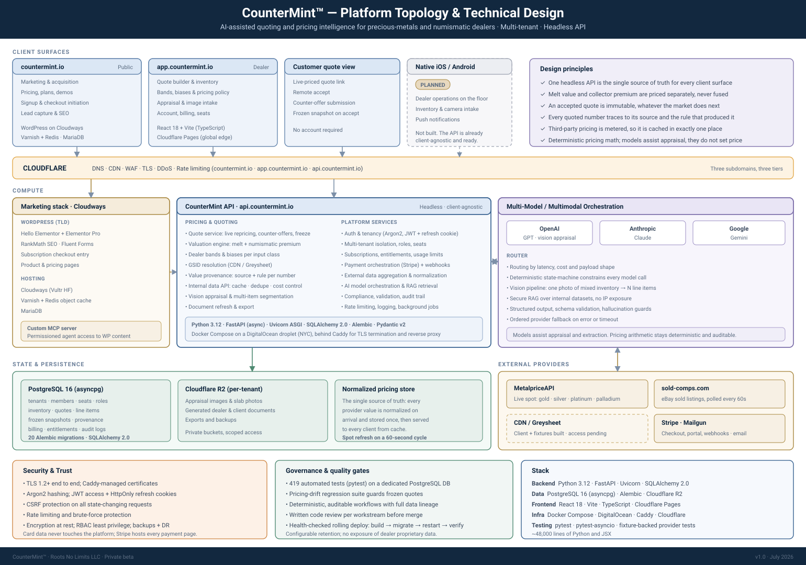
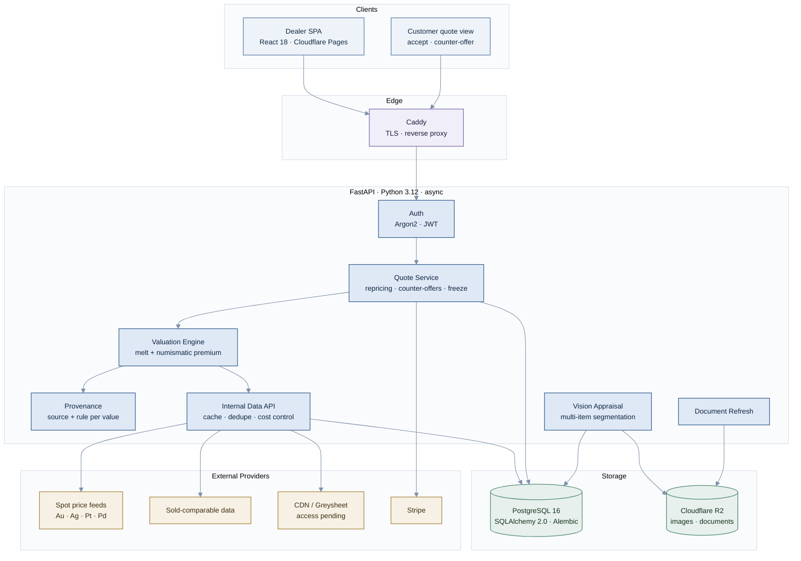
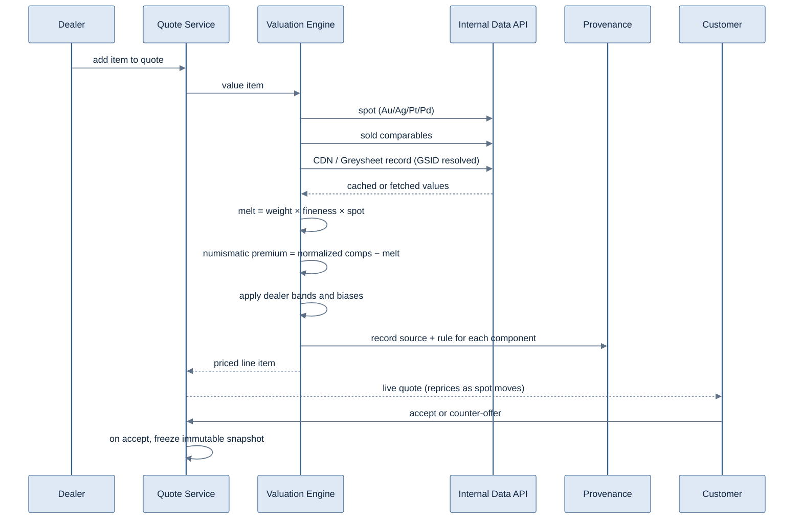
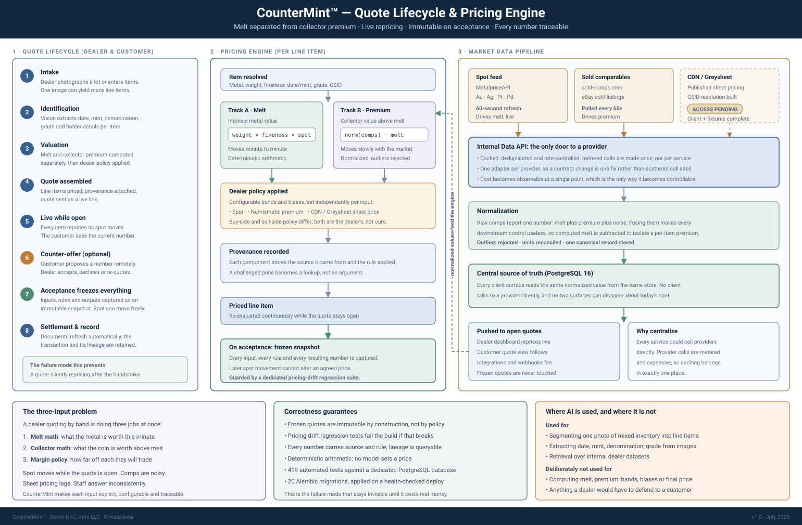

# CounterMint™: Architecture Overview

**AI-assisted quoting and pricing intelligence for precious-metals and numismatic dealers.**

Dealers quote against a market that moves all day. CounterMint reprices every line item continuously against live spot, separates melt value from collector premium using normalized sold-comparable data, lets the customer accept or counter remotely, and freezes the accepted quote to an immutable priced snapshot.

Python 3.12 / FastAPI on PostgreSQL, deployed with Docker Compose on DigitalOcean. Currently in private beta.

> Application source is private. This repository documents the architecture, the pricing model, and the design decisions behind them. Walkthroughs and demos available on request: [ray.j.kraft@gmail.com](mailto:ray.j.kraft@gmail.com).

**Links:** [countermint.io](https://countermint.io) | [Roots No Limits](https://rootsnolimits.com) | [LinkedIn](https://linkedin.com/in/raymondkraft)

---

## The problem

A dealer quoting a customer is doing three things at once, usually in a spreadsheet:

1. **Melt math.** What the metal is worth right now, per item, at this moment's spot price for gold, silver, platinum or palladium.
2. **Collector math.** What the *coin* is worth above melt, which depends on date, mint, grade and what comparable pieces actually sold for.
3. **Their own margin policy.** How far off each of those numbers they're willing to buy or sell, which differs per dealer, per metal, per item class.

Spot moves while the quote is open. Sold-comparable data is noisy and mixes melt and premium together. Published sheet pricing is a fourth input with its own lag. Doing this by hand is slow, inconsistent between staff, and quietly loses money when the market moves between quote and acceptance.

CounterMint makes each of those three inputs explicit, configurable, and traceable.

---

## What's implemented

| Area | Detail |
|---|---|
| Dynamic quoting | Every line item reprices continuously against Au / Ag / Pt / Pd spot |
| Remote acceptance | Customers review and accept quotes remotely, or return counter-offers |
| Quote immutability | Accepted quotes freeze to an immutable priced snapshot, guarded by pricing-drift regression tests |
| Valuation engine | Sold-comparable secondary-market data normalized to extract a per-item numismatic (collector) premium, separated from melt |
| Dealer configuration | Per-dealer bands and biases across spot price, numismatic premium, and CDN/Greysheet pricing |
| Sheet pricing | CDN/Greysheet client with GSID resolution and end-to-end value provenance, so every quoted number traces to the source and rule that produced it |
| Data centralization | All client and dealer data behind a single internal API: third-party pricing calls cached, deduplicated and cost-controlled |
| Document automation | Dealer and client documents refresh automatically rather than being regenerated by hand |
| Computer vision | Structured item data extracted from coin and slab images for AI-assisted assessment |
| Auth | Argon2 password hashing, JWT access tokens with refresh cookies |
| Billing | Stripe Checkout and Customer Portal with webhook processing |

**In progress:** commercial CDN/Greysheet API access is under negotiation with the publisher; the client, GSID resolution and test fixtures are complete and tested against recorded fixtures.

**Planned, not built:** native iOS/Android apps.

---

## Platform topology

Full-resolution topology and technical design, covering the hosting split, service boundaries, external data providers, and security posture:

  

Marketing site, authenticated SPA, and headless API, with the AI orchestration layer and external pricing providers. Native mobile clients are planned, not shipped.

## System architecture

## Pricing flow: one line item

---

## Design decisions

Full ADRs in [`docs/decisions/`](docs/decisions). The three that matter most:

### Separating melt from numismatic premium

Sold-comparable data reports one number: what someone paid. That number is melt plus collector premium plus noise, and treating it as a single price makes every downstream control useless: a dealer can't apply a different policy to metal risk than to collector risk when the two are fused.

The valuation engine normalizes comparables and subtracts computed melt to isolate a per-item numismatic premium. Melt then moves with spot, minute to minute, while premium moves slowly with the collector market. Dealers configure bands and biases independently against each. It's more work than quoting off raw comps, and it's the difference between a pricing tool and a spreadsheet with a chart on it.

### Immutable quote snapshots

A quote is a commitment against a moving market. If a customer accepts on Tuesday and the system recomputes on Wednesday's spot, the dealer's position silently changes and nobody notices until reconciliation. Acceptance freezes the full priced snapshot (every input, every rule, every resulting number), and dedicated regression tests exist specifically to catch pricing drift, because this is the failure mode that would be invisible until it cost real money.

### Centralizing third-party data behind an internal API

Every service could call the pricing providers directly. Instead all of them go through one internal API. Three reasons: third-party pricing calls are metered and expensive, so caching and deduplication belong in exactly one place; provider contracts change, and one adapter is cheaper to fix than call sites scattered through the codebase; and cost is only controllable if it's observable at a single point.

### Value provenance

Every quoted number carries the source and the rule that produced it. A dealer challenging a price gets an answer instead of an argument, and debugging a wrong quote is a lookup rather than an investigation.

---

## Quote lifecycle and pricing engine

The quote from intake to frozen snapshot, how a single line item is actually priced, and where the market data comes from:

  

Melt and collector premium are computed on separate tracks and only combined after dealer policy is applied. Models assist identification; they never set a price.

---

## Engineering practices

- **419 automated tests** (pytest) passing against a live PostgreSQL test database
- **20 Alembic migrations**, applied on deploy with health-checked rollout
- Containerized deploy: `docker compose build` → `alembic upgrade head` → rolling restart → `/healthz` verification
- ~48,000 lines of Python and JSX across the codebase (excluding lockfiles and generated artifacts)

### On AI-assisted development

This codebase is built with AI-assisted engineering workflows: specs and plans written first, implementation generated and reviewed, then gated behind the test suite, migration checks, and a written code review per workstream before anything merges or deploys. The architecture decisions, the pricing model, the review, and everything running in production are mine. The tooling changes how fast code gets written; it doesn't change who is accountable for whether it's correct.

---

## Screenshots

<!-- Replace with real files. 4-6 images. Use a demo dealer with fictional inventory. -->

| | |
|---|---|
|  *Line items repricing against live spot* |  *Customer-side remote acceptance and counter-offer* |
|  *Per-dealer bands and biases across spot, premium and sheet pricing* |  *Value provenance: a quoted number traced to its source and rule* |

---

## Stack

Python 3.12 | FastAPI (async) | SQLAlchemy 2.0 | Alembic | PostgreSQL 16 | pytest | Docker Compose | Caddy | DigitalOcean | Cloudflare R2 & Pages | React 18 + Vite | Stripe

---

Built and operated by **Raymond J. Kraft** | [rootsnolimits.com](https://rootsnolimits.com) | [LinkedIn](https://linkedin.com/in/raymondkraft)
