# CounterMint product tour

[← Back to the project overview](../README.md) · [Quote Studio](quote-studio.md) · [Market intelligence](market-intelligence.md) · [System architecture](architecture.md) · [Engineering evidence](engineering-evidence.md)

These screenshots use demonstration workspaces and test data, not customer records. The current set is dated August 2026 and shows Quote Studio v3. Older private-beta screens are labeled inline where they still explain a current workflow. The staff screenshot has its contact fields permanently redacted.

## 1. Capture the item and preserve catalog identity

  <a href="../screenshots/vision-intake-segmented.png">
    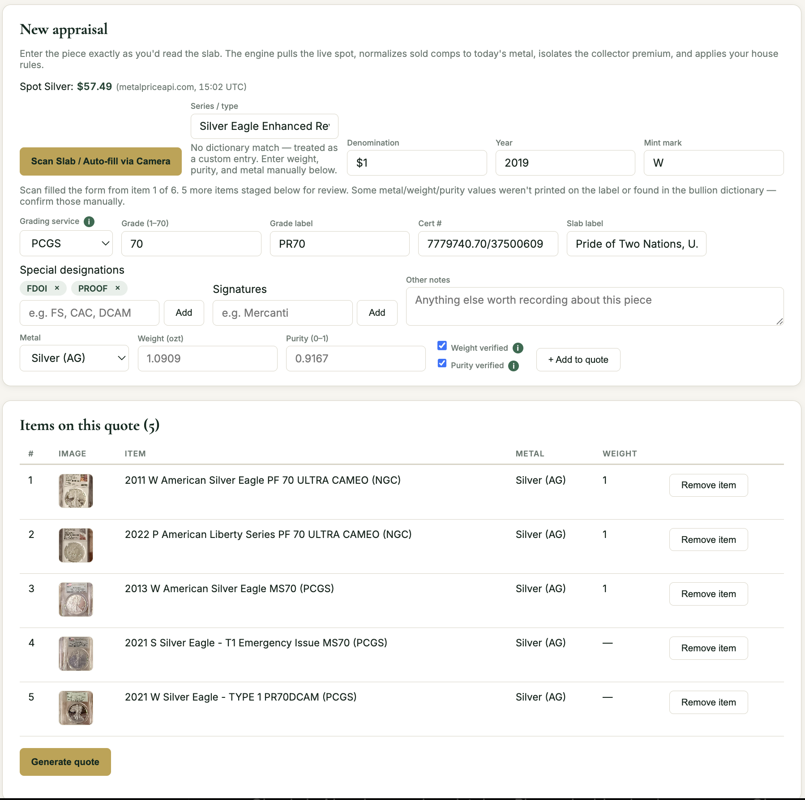
  </a>

**Earlier private-beta UI.** A single photo of six graded slabs becomes six staged items. The system resolves metal, weight, and purity where evidence supports it; missing or uncertain label fields go to dealer confirmation rather than being guessed.

  <a href="../screenshots/vision-intake-processing.png">
    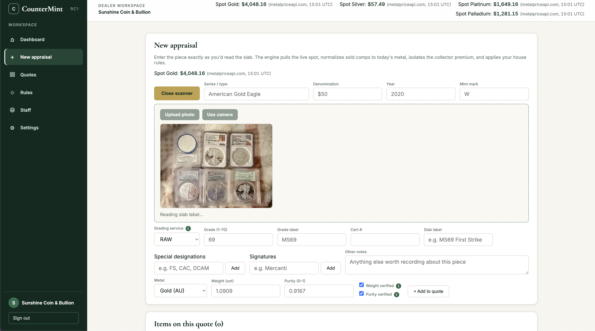
  </a>

**Earlier private-beta UI.** The intake path keeps current spot, source, and timestamp visible while image processing runs.

  <a href="../screenshots/cdn-gsid-appraisal.png">
    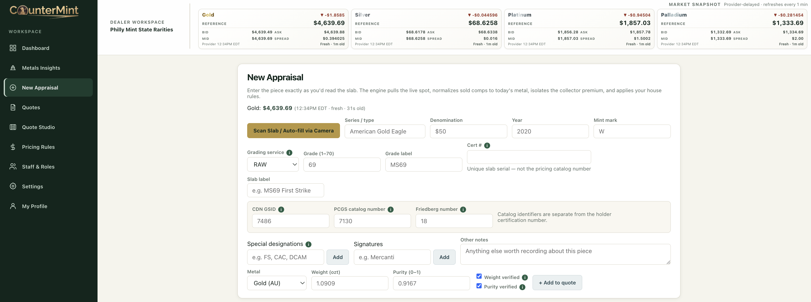
  </a>

Catalog identifiers stay distinct. GSID, PCGS catalog number, and Friedberg number describe catalog identity; the certification number remains the holder's unique slab serial. This is the standard appraisal form, not a sandbox screenshot. In sandbox mode, GSID opens a separate enhanced workspace with detailed item insights, protected reference context, independent cross-checks, versioned rule output, staging, and DRAFT review. That additional UI is not pictured publicly; see the [sandbox licensing boundary](cdn-sandbox.md).

## 2. Price melt and collector premium separately

  <a href="../screenshots/quote-melt-premium-breakdown.png">
    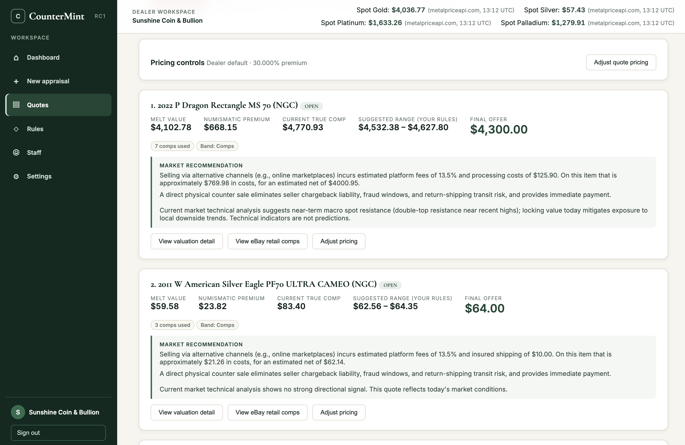
  </a>

**Earlier private-beta UI.** The layout has changed, but the versioned pricing contract is current: each eligible metal-bearing line keeps melt, collector premium, market evidence, dealer-policy range, and final offer separate.

  <a href="../screenshots/valuation-detail-provenance.png">
    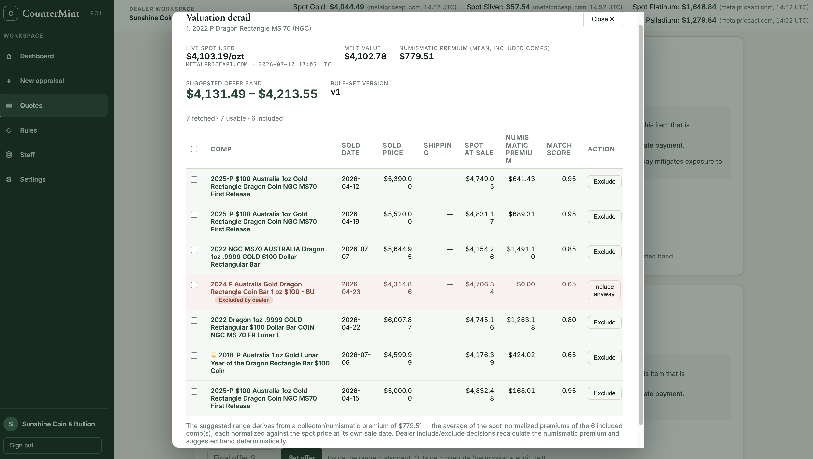
  </a>

**Earlier private-beta UI.** Comparable sales are normalized against spot at their own sale dates. Match scores, inclusion decisions, and the derived premium remain inspectable, and changing the evidence set recalculates deterministically.

  <a href="../screenshots/comp-outlier-rejection.png">
    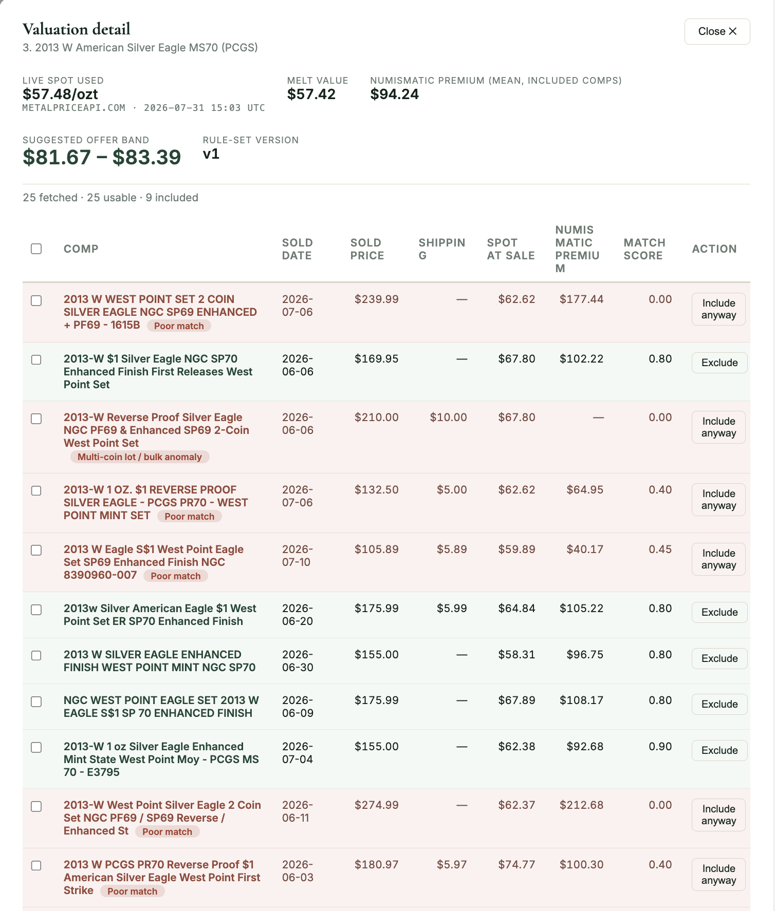
  </a>

**Earlier private-beta UI.** Automatic removals carry reasons such as poor match, multi-coin lot, or bulk anomaly. A permissioned dealer can override the normal band without erasing the audit trail.

## 3. Explore market history without confusing it with quote authority

Gold, silver, platinum, and palladium stay visible across the dealer workspace. Metals Insights adds 16 other metal instruments in a searchable catalog, for 20 instruments in total.

  <a href="../screenshots/metals-insights-candles.png">
    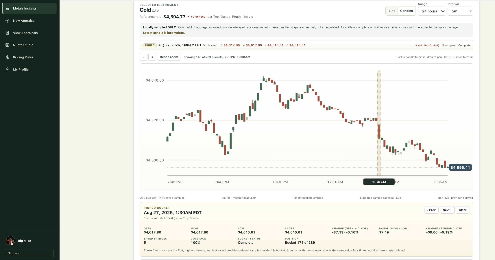
  </a>

The candlestick view supports selectable ranges and intervals, zoom, pan, bucket pinning, previous/next navigation, and detailed OHLC inspection. This 24-hour view uses five-minute buckets and keeps the latest incomplete candle visibly separate from completed history.

  <a href="../screenshots/metals-insights-line-chart.png">
    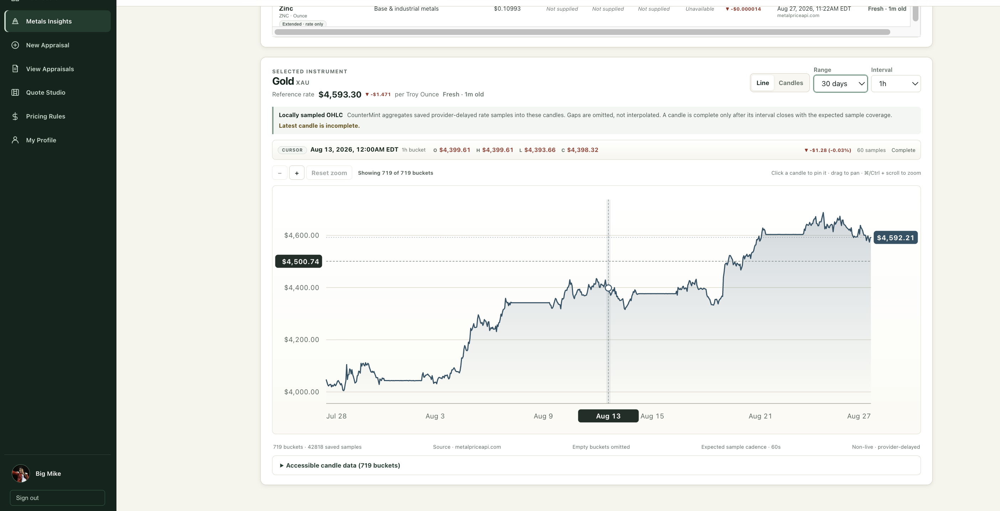
  </a>

The line view uses the same native charting path and stored observations. Here, a 30-day range is shown at one-hour intervals with cursor inspection, zoom, pan, and an accessible data table.

Provider observations are delayed by one minute. CounterMint derives candles from the samples it actually stored: first sample for open, observed extrema for high and low, and last sample for close. Empty intervals remain gaps. Metals Insights is dealer research context, not a live trading tool, and it remains separate from the authoritative melt path.

[See the market-series derivation and failure behavior →](market-intelligence.md)

## 4. Make dealer policy explicit and reproducible

  <a href="../screenshots/pricing-rules-default.png">
    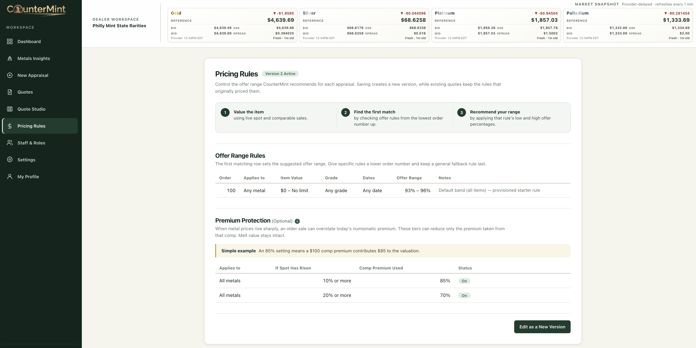
  </a>

The first matching versioned rule produces the suggested range. Premium Protection reduces only the collector-premium contribution from older comparable sales after a sharp increase in spot; current melt remains intact.

  <a href="../screenshots/dealer-pricing-rules.png">
    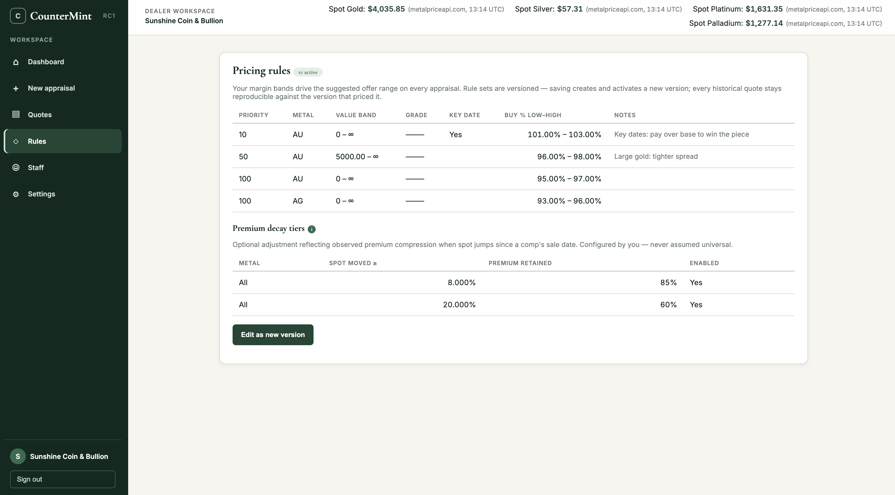
  </a>

**Earlier private-beta UI.** The current rules screen appears above. The versioning contract remains the same: saving activates a new policy version, and historical quotes stay tied to the version that priced them.

  <a href="../screenshots/out-of-band-override.png">
    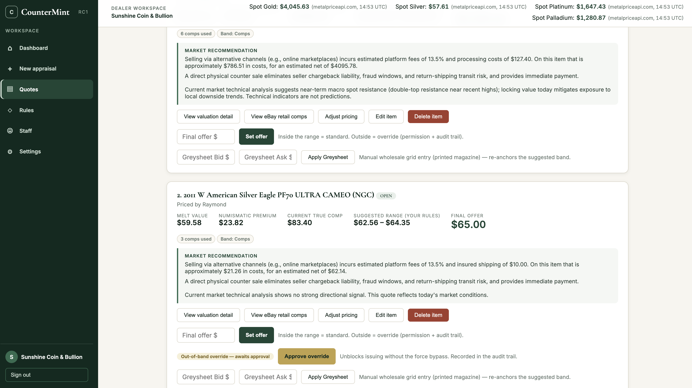
  </a>

**Earlier private-beta UI.** A price outside the suggested band is an override, not a silent edit. Outside-range authority is permission-gated, and attribution preserves who made the decision.

## 5. Design the quote against the real customer renderer

  <a href="../screenshots/quote-studio-overview.png">
    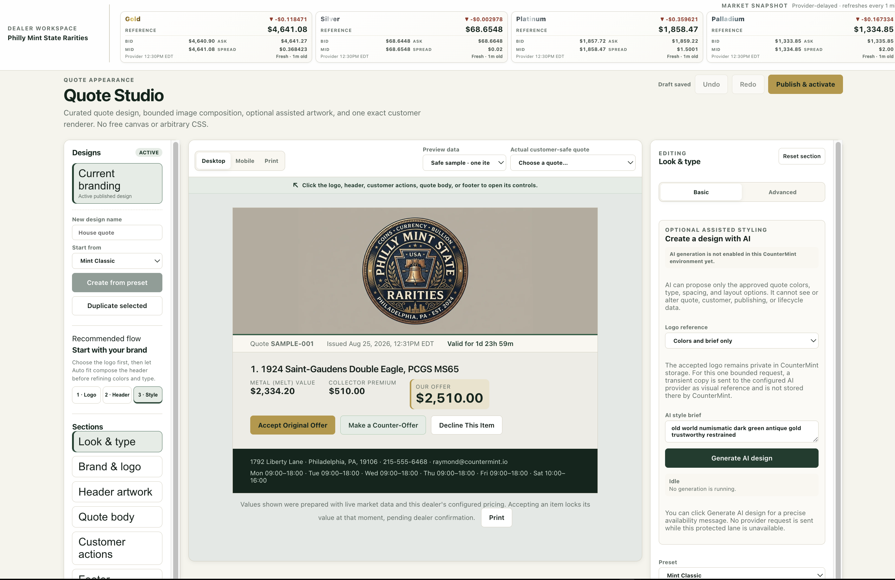
  </a>

The editor is built around the customer quote itself. Dealers choose curated presets, edit drafts, preview safe sample or actual customer-safe data, switch desktop/mobile/print modes, and publish a reviewed design. AI is not enabled in the environment shown; the deterministic editor remains fully usable and sends no provider request.

  <a href="../screenshots/quote-studio-header-artwork.png">
    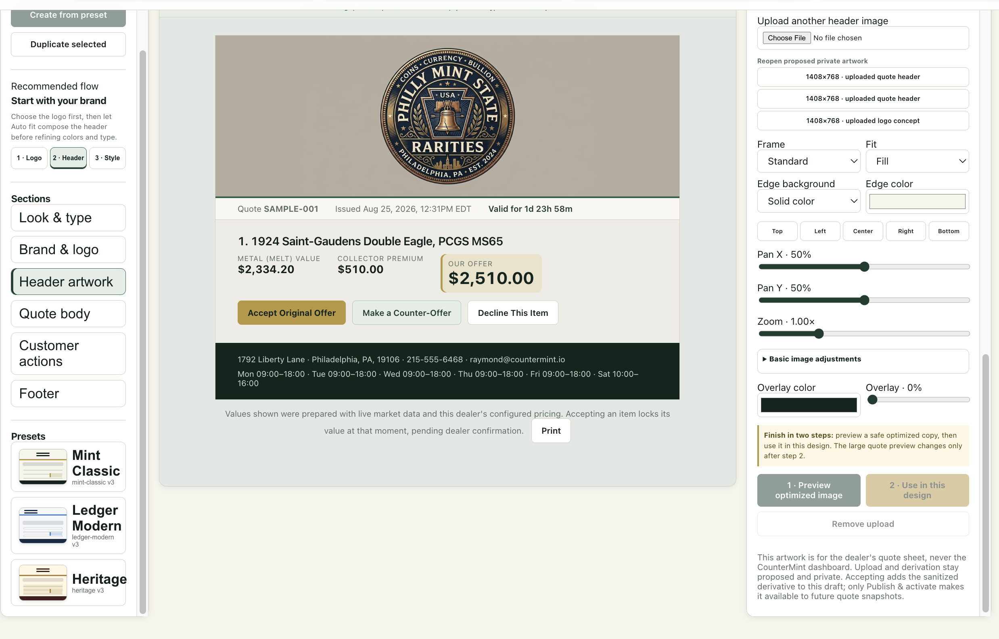
  </a>

Clicking the rendered logo, header, customer actions, quote body, or footer opens the schema-approved controls for that region. Header artwork additionally supports bounded dragging, keyboard positioning, locked-proportion resizing, pan, zoom, fit, edge treatment, image adjustments, and overlay.

  <a href="../screenshots/quote-studio-image-controls.png">
    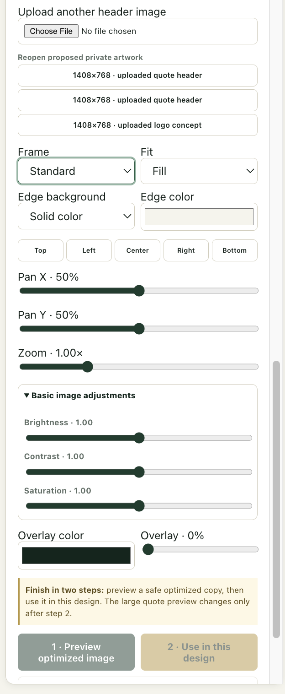
  </a>

Uploaded or generated artwork begins as a private proposal. CounterMint creates a sanitized, optimized derivative that must be reviewed, accepted into the draft, and separately published.

Capability-gated AI lanes can propose text-free header artwork, symbol-first logo concepts, and approved style-token changes. They cannot alter customer data, quote values, lifecycle state, or publishing state.

[Explore the full structured-design and AI safety model →](quote-studio.md)

## 6. Negotiate end to end

  <a href="../screenshots/quote-studio-customer-actions.png">
    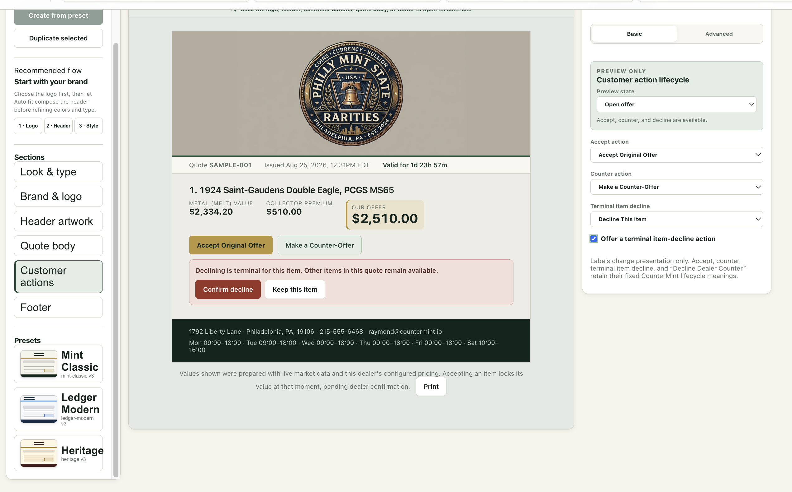
  </a>

Customer-facing labels are configurable, but lifecycle meaning is not. The server owns accept, customer counter, dealer accept/reject/counter-back, customer response to the dealer counter, and terminal per-item decline. The dealer can configure attempt limits and review thresholds without creating an endless negotiation loop.

  <a href="../screenshots/customer-quote-spot-drift.png">
    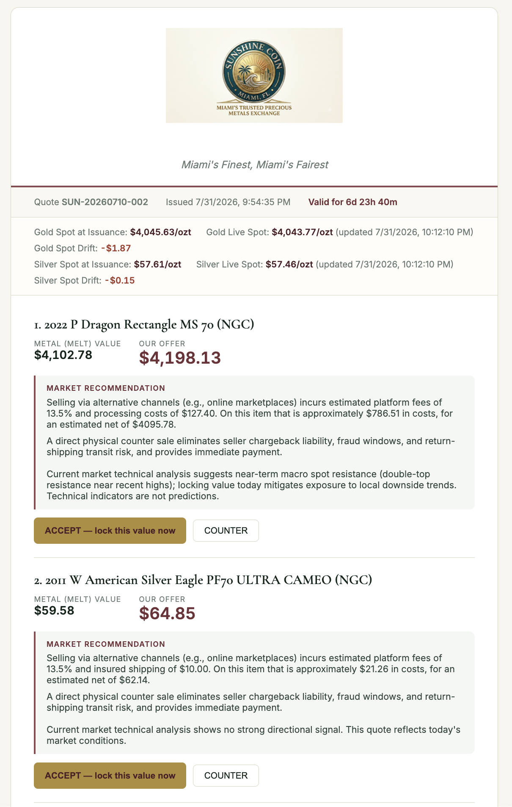
  </a>

**Earlier private-beta UI.** The customer sees issuance spot, current spot, and drift before responding. Acceptance captures the value offered at that moment. The issued presentation and accepted observation are versioned records; review or a new counter never overwrites the customer's earlier action.

## 7. Govern staff authority and public attribution

  <a href="../screenshots/staff-roles-attribution-redacted.png">
    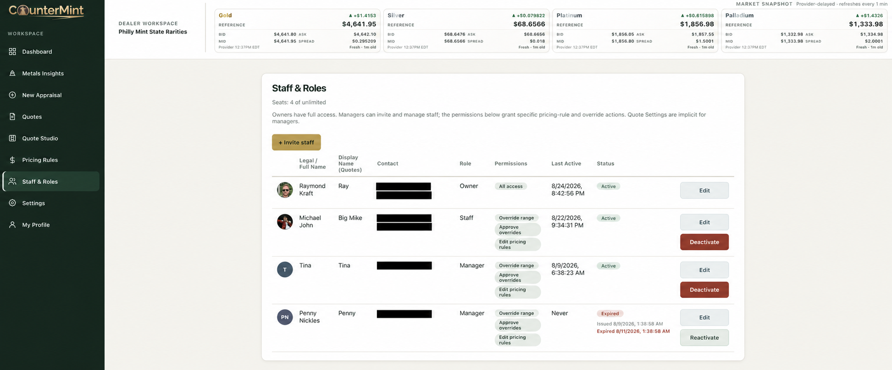
  </a>

Staff & Roles separates internal identity, dealer-approved quote display name, role, pricing authority, activity, and account status. Invitations, deactivation, and reactivation remain tenant-scoped; outside-range decisions and quote/pricing attribution remain auditable.

Public attribution is dealer opt-in and exposes only the approved nickname or first-name fallback—not legal contact details. Every email address and phone number in this screenshot was permanently covered in the exported raster and verified absent by OCR before publication.

---

[View the live customer quote](https://app.countermint.io/q/YcQk3L7mU5mVaF5L-es1bGU8pUIZy7_JVTSQmR-gBOg) · [Review the architecture](architecture.md) · [Review the roadmap](roadmap.md) · [Request a walkthrough](mailto:ray@rootsnolimits.com)
